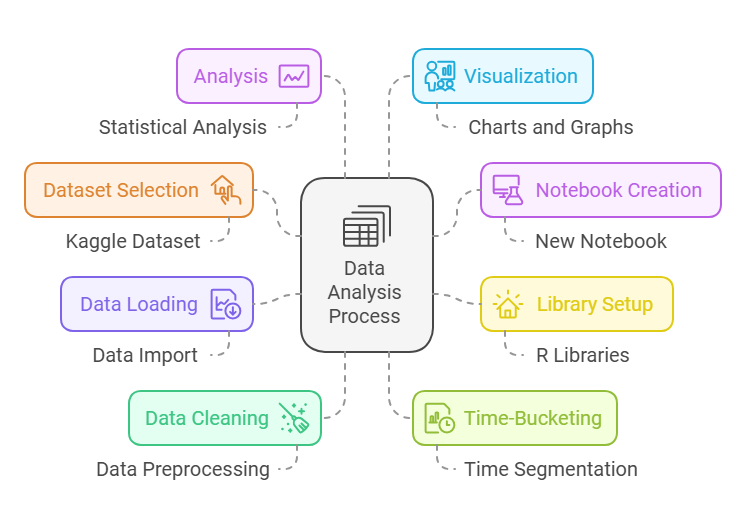
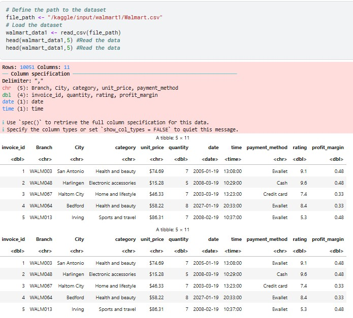
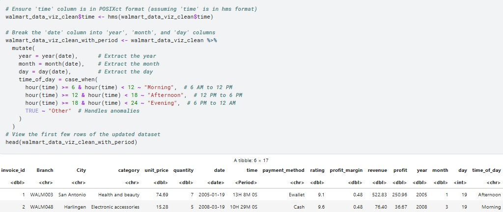
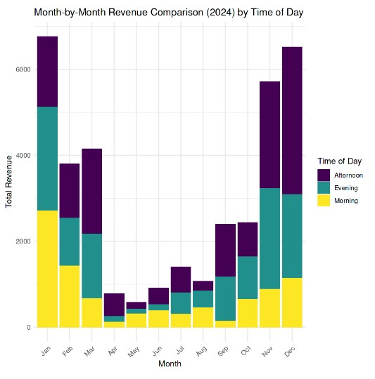
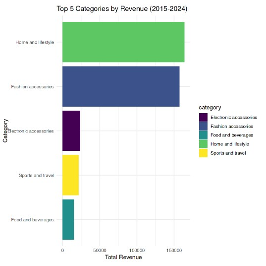
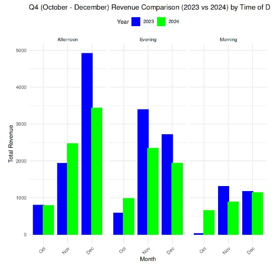

# Walmart-Sales-Analysis

## 👋 Hello, Welcome to my next project 'R - Walmart Analysis' !

<h4 align="center">This project intends to provide hands on using R for analysis and visualization.</h4>
<!-- R Visualization

  

 -->

Please scroll down to know more about this project

[Explore other projects »](https://github.com/paudel7?tab=repositories)

  <a href="your-demo-link">View Demo</a>
  ·
  <a href="your-bug-report-link">Report Bug</a>
  ·
  <a href="your-feature-request-link">Request Feature</a>

  
  
  

## 🎯 About The Project
**[Please visit the Google site for detailed documentation »](https://sites.google.com/view/walmartsalesanalysis/home?authuser=1)**  
**Vizualization Process**

  

Starting from selecting dataset and creating notebook in Kaggle and then cleaning, it ends up with creating analysis and making visuals thereon.

## ✨ Demo-Preview

Here are some demo we can get in this project:

**Data Read**

 

 

**Time Breakdown for Analysis**
 
  
 
 

 **Shiftwise MoM Comparative**
 
  
 
 

 **2 Year's MoM Comparative**

 

 

 **Top 5 Category**
 
  
 
 

 **2 Year's Quarterly Comparative**
 
  
 
 

 

<!-- ## ⚡ Workflow

<!--

  

NA at this moment

## 📚 References

<!--

  

NA at this moment

## 📋 Table of Contents 
<!-- - [Demo-Preview](#-demo-preview)
- [Workflow](#-workflow)
- [References](#-references)
- [Installation](#-installation)
- [Usage](#-usage)
- [Contribute](#-contribute)
- [License](#-license)
- [Contact](#-contact)
- [Acknowledgments](#-acknowledgments)

## 🚀 Installation

Please follow the steps in the instruction text file.

(<a href="#-table-of-contents">back to top</a>)

## 💡 Usage

For more usage info, just take a look at the instruction text file.

(<a href="#-table-of-contents">back to top</a>)

## 🤝 Contribute

Contributions are what make the open source community such an amazing place to learn, inspire, and create. Any contributions you make are **greatly appreciated**.

1. Fork the Project
2. Create your Feature Branch (`git checkout -b feature/[FeatureName]`)
3. Commit your Changes (`git commit -m '[Your Commit Message]'`)
4. Push to the Branch (`git push origin feature/[FeatureName]`)
5. Open a Pull Request

(<a href="#-table-of-contents">back to top</a>)

## 📝 License

Distributed under the [License Type] License. See `LICENSE.txt` for more information.

(<a href="#-table-of-contents">back to top</a>)
 -->

## 📫 Contact

  
  
  

## 🛠️ Languages and Tools

 

  <!-- Add your tech stack icons here 
  
  Add more tools as needed

-->

## 🙏 Acknowledgments

Here is a list of some of the resources I found helpful and would like to give credit to:
* Kevin Kiruri on Medium

  **[For more details about the project »](https://sites.google.com/view/walmartsalesanalysis/home?authuser=1)**

<!-- 
(<a href="#-table-of-contents">back to top</a>)
 -->

---

If you found this project helpful, please consider giving it a ⭐!

